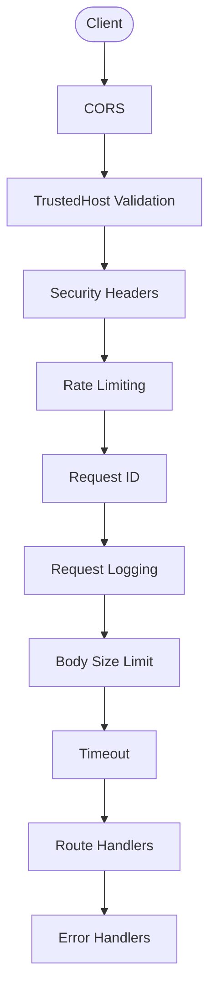

# Architecture

This project is a FastAPI service template designed around explicit composition,
typed settings, and production-oriented runtime defaults. The codebase favors a
small number of clear integration seams over hidden global setup so new routes,
middleware, and dependencies can be added without turning startup into a black
box.

## Goals

- Keep bootstrap logic explicit and testable.
- Default to secure behavior for docs, diagnostics, and dependency exposure.
- Make readiness depend on real downstream dependencies instead of process-only
  liveness.
- Support local SQLite development while allowing migration to Postgres and
  Redis-backed production deployments.

## Project Layout

The template uses a `src/` layout with an installable package defined in
`pyproject.toml`. When `uv sync` runs, it installs the project itself into the
virtualenv alongside its dependencies. This is what makes `from app.settings
import Settings` work everywhere — local dev, Docker, pytest, Alembic — without
any manual `PYTHONPATH` configuration.

Without the installable package, every execution context would need
`PYTHONPATH=src` set explicitly: in your shell, in the Dockerfile, in CI
scripts, in pytest config, and in the Alembic env. The `[build-system]` and
hatch source layout eliminate that by registering `src/app/` on the Python path
automatically during `uv sync`.

This project is a template, not a library meant for PyPI distribution. The
packaging setup exists purely for import ergonomics. When using this template as
a starting point, rename `fastapi-chassis` in `pyproject.toml` to your project
name and continue building under `src/app/`.

## High-Level Components

- `main.py`: importable ASGI entrypoint and local `uvicorn.run(...)` path.
- `src/app/__init__.py`: application factory exposing `create_app(settings=...)`.
- `src/app/app_builder.py`: builder-style application composition.
- `src/app/lifespan.py`: startup and shutdown resource ownership.
- `src/app/settings.py`: typed configuration sourced from `APP_*` variables and
  optional `.env`.
- `src/app/routes/health.py`: root, liveness, readiness, favicon, and optional
  diagnostic endpoints.
- `src/app/routes/api.py`: example protected API routes.
- `src/app/auth/`: stateless JWT validation and authorization dependencies.
- `src/app/db/`: SQLAlchemy engine/session wiring, ORM models, and DB readiness.
- `src/app/middleware/`: request hardening, timeout, IDs, logging, rate limits,
  and security headers.
- `src/app/errors/`: normalized error responses for validation, HTTP, and
  unhandled exceptions.
- `src/app/observability/`: OpenTelemetry setup and instrumentation hooks.
- `src/app/readiness/`: dependency-aware readiness registry.

## Bootstrap Flow

Application creation is intentionally linear:

1. `create_app()` resolves settings and configures root logging.
2. `FastAPIAppBuilder` creates the base `FastAPI` object.
3. Builder stages attach settings, logging, DB placeholders, auth wiring,
   tracing, metrics, error handlers, routes, and middleware.
4. The builder returns a fully configured app.
5. FastAPI lifespan startup creates long-lived runtime resources.

This separation keeps import-time side effects low and allows tests to inject
custom settings without patching module globals.

## Runtime Resource Model

The lifespan manager owns long-lived shared resources:

- async SQLAlchemy engine,
- async SQLAlchemy session factory,
- shared `httpx.AsyncClient`,
- JWT auth service.

These resources live on `app.state` and are reused across requests. Startup
initializes them before the first request. Shutdown closes the HTTP client and
disposes the DB engine.

## Request Flow

For an HTTP request, the effective flow is:

1. CORS middleware handles preflight requests first.
2. Trusted host validation rejects unexpected `Host` headers.
3. Security headers are applied to successful and error responses.
4. Optional rate limiting runs before route logic.
5. Request ID middleware establishes request and correlation IDs.
6. Request logging emits one structured log event per request, including
   rejected `429` rate-limit responses.
7. Body-size enforcement rejects oversized payloads.
8. Timeout middleware bounds request duration.
9. Route handlers and dependencies execute.
10. Error handlers normalize failures into JSON responses.

Middleware registration order matters because Starlette executes middleware in
reverse order of registration. The builder keeps that order documented in one
place.

### Middleware Order Diagram

Requests flow top-to-bottom on the way in and bottom-to-top on the way out.
Starlette adds middleware in reverse registration order, so the builder
registers timeout first and CORS last.

## Authentication Model

This service acts as a resource server. It validates externally-issued JWTs and
does not handle login flows or browser sessions.

Supported verification modes:

- shared secret for local/test use,
- static public key,
- JWKS endpoint for rotating signing keys.

Protected-route authorization uses normalized `Principal` objects and dependency
helpers for required scopes and roles.

### JWKS Behavior

- JWKS URLs must use HTTPS.
- Cached keys are reused until TTL expiry.
- If a token `kid` is missing from the current cache, the service forces one
  refresh before rejecting the token so normal key rotation does not require a
  restart.
- If refresh fails but a prior JWKS cache exists, the service continues using
  the stale cache for already-known keys and reports that degraded state in
  readiness details. Tokens signed by brand new keys still require a successful
  refresh.
- Lifespan startup logs and continues when JWKS warm-up fails so the process can
  start and `/ready` can report the dependency failure instead of aborting
  startup entirely.

## Database Model

The template is SQLite-first for local development:

- runtime URL defaults to `sqlite+aiosqlite:///./data/app.db`,
- Alembic URL defaults to `sqlite:///./data/app.db`.

For production, SQLite is appropriate only for low-write or single-process
deployments. Multi-worker or write-heavy environments should move to Postgres
or another server database and set both `APP_DATABASE_URL` and
`APP_ALEMBIC_DATABASE_URL` explicitly.

## Readiness Model

Liveness and readiness are intentionally separate:

- `/healthcheck` only indicates the process is running.
- `/ready` aggregates dependency checks.

Current readiness checks cover:

- application wiring,
- database availability,
- authentication dependency availability.

Readiness details are hidden by default and can be enabled only for trusted
environments with `APP_READINESS_INCLUDE_DETAILS=true`.

## Observability Model

The service includes:

- structured application logs,
- request and correlation IDs,
- optional Prometheus metrics,
- optional OpenTelemetry tracing.

Request logging records the request path and a redacted query-string view.
Error payloads and error logs return path-only values so query-string secrets do
not leak back to clients or logs. Validation errors also remove rejected input
values from their payloads and warning logs.

## Configuration Model

All runtime configuration is exposed through `Settings` in `src/app/settings.py`
and sourced from `APP_*` variables.

Important traits:

- docs and diagnostics are opt-in,
- metrics are opt-in,
- auth fails closed when enabled without verification material,
- trusted-host enforcement is on by default,
- proxy-aware rate limiting requires both explicit opt-in and an explicit
  trusted-proxy allowlist.
- proxy-aware HTTPS semantics require a separate trusted-proxy allowlist before
  `X-Forwarded-Proto` is honored.

## Testing Strategy

The test suite is split into:

- unit tests for isolated components and negative paths,
- integration tests exercising the assembled ASGI app via HTTP,
- a live verification harness in `ops/test_stack.py` that runs the service with
  temporary infrastructure and performs end-to-end checks over a real socket.

The core design choice that makes this practical is factory-based application
creation with injectable settings.
